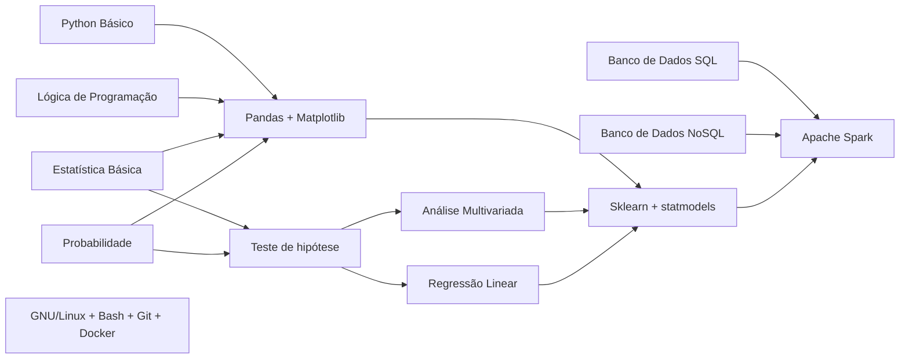

# Data Science - Meu material de estudo

### Minha trilha de estudos - Roadmap

| Ordem | Curso | Descrição | Links | Acesso | Repositório |
| :---: | :---: | :---:     | :---: | :---:  | :---:       |
| 1. | Git/GitHub | Aqui você aprenderá sobre versionamento de documentos simples e código | [Twitch](https://www.twitch.tv/collections/0Y_K7vMBsRf4mw) / [YouTube](https://youtube.com/playlist?list=PLvlkVRRKOYFQ3cfYPjLeQ0KvrQ8bG5H11&si=PsaP0KviQYsDxVOc) | Grátis | - |
| 2. | Introdução à Programação com Python | Seus primeiros passos no mundo da programação utilizando Python | [Twitch](https://www.twitch.tv/collections/ifV7zaeStxdLGg) / [YouTube](https://youtube.com/playlist?list=PLvlkVRRKOYFRXdquucikNbwYeFzzzYIGb&si=vo6SPepASfL0UkXR) | Grátis | [GitHub](https://github.com/TeoMeWhy/python-2024) |
| 3. | Desbravando Pandas | Vamos manipular dados utilizando Pandas com seus Dataframes e Series | [Twitch](https://www.twitch.tv/collections/TpcyQRUNvBf47g) / [YouTube](https://www.youtube.com/playlist?list=PLvlkVRRKOYFSl-XCxNQ1u3uOLvDnYxupG) | Grátis | [GitHub](https://github.com/TeoMeWhy/desbravando-pandas) |
| 4. | Coleta de dados na Web | Como coletar, armazenar e organizar dados coletados a aprtir de web scraping e APIs | [Twitch](https://www.twitch.tv/collections/qDR-u9gMwBeptg) / [YouTube](https://www.youtube.com/playlist?list=PLvlkVRRKOYFSrkOL-Bze-42pTdJIAj0_h) | Grátis | [GitHub](https://github.com/TeoMeWhy/data-collect)
| 5. | Estatística Básica | Principais tópicos de Estatística aplicada à ciência de dados e Analytics | [Twitch](https://www.twitch.tv/collections/6sM5PdmdxhcS3w) / [YouTube](https://www.youtube.com/playlist?list=PLvlkVRRKOYFSWIyhwq4Nu8sNd_GfOi1tj) | Grátis | - |
| 6. | Machine Learning para Pôneis | Curso de Introdução à Machine Learning com as principais técnicas de Classificação e Regressão | [Twitch](https://www.twitch.tv/collections/B7O8mo0SzxcXnA) / [YouTube](https://www.youtube.com/playlist?list=PLvlkVRRKOYFTXcpttQSZmv1wDg7F3uH7o) | Grátis | [Github](https://github.com/TeoMeWhy/ml-4-poneis) |
| 7. | Data Science e Pontos | Projeto completo de Data Science construindo um modelo de ML para predição de Churn | [Twitch](https://www.twitch.tv/collections/jg9itHOO1ReLcw) / [YouTube](https://www.youtube.com/playlist?list=PLvlkVRRKOYFQOkwDvfgCvKi9-I1jQXiy7) | Membros e Subs | [GitHub](https://github.com/TeoMeWhy/ds-points) |

