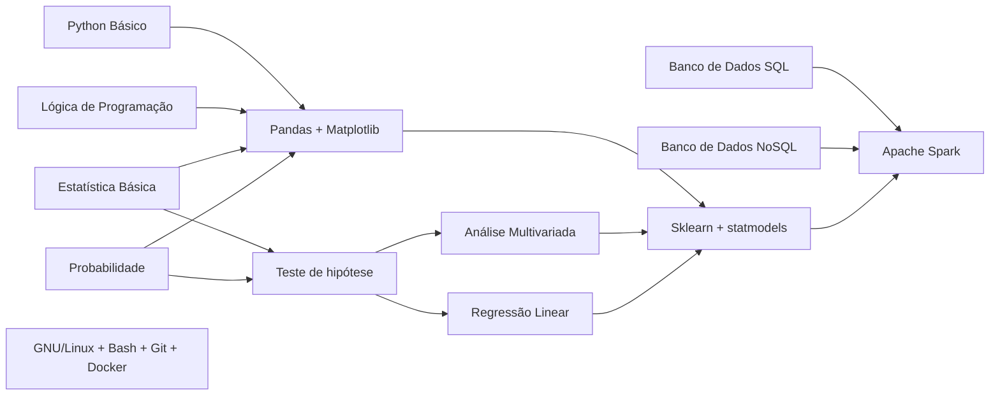

Repositório para divulgação de material em Data Science, Programação e Estatística.

* [Primeiros passos](#primeiros-passos)
* [Temas](#temas)
* [Blogs](#blogs--sites)
* [Perfis](#perfis)
* [Podcasts](#podcasts)

## Primeiros passos

Muitos iniciantes tem dificuldade de visualizar o caminho de formação na área de dados. Tentando abstrair um pouco essa jornada, criamos o fluxo abaixo, onde tem-se as dependências de skills e temas.

Desta forma, cada nó deste grafo pode receber interação para direcionar o material focado nesta disciplina.

E ah, você pode usar [essa planilha](https://docs.google.com/spreadsheets/d/1RpGhP2MDjTiyc7TgnrTHCLKMigEvn2x_tGJw8HDkj24/edit?usp=sharing) para definir seus planos de estudos ao mapear as habilidades em que precisa se desenvolver mais para alcançar seus objetivos: [clique aqui](https://docs.google.com/spreadsheets/d/1RpGhP2MDjTiyc7TgnrTHCLKMigEvn2x_tGJw8HDkj24/edit?usp=sharing)

### Sugestão de trilha em Data Science

| Ordem | Curso | Descrição | Links | Acesso | Repositório |
| :---: | :---: | :---:     | :---: | :---:  | :---:       |
| 1. | Git/GitHub | Aqui você aprenderá sobre versionamento de documentos simples e código | [Twitch](https://www.twitch.tv/collections/0Y_K7vMBsRf4mw) / [YouTube](https://youtube.com/playlist?list=PLvlkVRRKOYFQ3cfYPjLeQ0KvrQ8bG5H11&si=PsaP0KviQYsDxVOc) | Grátis | - |
| 2. | Introdução à Programação com Python | Seus primeiros passos no mundo da programação utilizando Python | [Twitch](https://www.twitch.tv/collections/ifV7zaeStxdLGg) / [YouTube](https://youtube.com/playlist?list=PLvlkVRRKOYFRXdquucikNbwYeFzzzYIGb&si=vo6SPepASfL0UkXR) | Grátis | [GitHub](https://github.com/TeoMeWhy/python-2024) |
| 3. | Desbravando Pandas | Vamos manipular dados utilizando Pandas com seus Dataframes e Series | [Twitch](https://www.twitch.tv/collections/TpcyQRUNvBf47g) / [YouTube](https://www.youtube.com/playlist?list=PLvlkVRRKOYFSl-XCxNQ1u3uOLvDnYxupG) | Grátis | [GitHub](https://github.com/TeoMeWhy/desbravando-pandas) |
| 4. | Coleta de dados na Web | Como coletar, armazenar e organizar dados coletados a aprtir de web scraping e APIs | [Twitch](https://www.twitch.tv/collections/qDR-u9gMwBeptg) / [YouTube](https://www.youtube.com/playlist?list=PLvlkVRRKOYFSrkOL-Bze-42pTdJIAj0_h) | Grátis | [GitHub](https://github.com/TeoMeWhy/data-collect)
| 5. | Estatística Básica | Principais tópicos de Estatística aplicada à ciência de dados e Analytics | [Twitch](https://www.twitch.tv/collections/6sM5PdmdxhcS3w) / [YouTube](https://www.youtube.com/playlist?list=PLvlkVRRKOYFSWIyhwq4Nu8sNd_GfOi1tj) | Grátis | - |
| 6. | Machine Learning para Pôneis | Curso de Introdução à Machine Learning com as principais técnicas de Classificação e Regressão | [Twitch](https://www.twitch.tv/collections/B7O8mo0SzxcXnA) / [YouTube](https://www.youtube.com/playlist?list=PLvlkVRRKOYFTXcpttQSZmv1wDg7F3uH7o) | Grátis | [Github](https://github.com/TeoMeWhy/ml-4-poneis) |
| 7. | Data Science e Pontos | Projeto completo de Data Science construindo um modelo de ML para predição de Churn | [Twitch](https://www.twitch.tv/collections/jg9itHOO1ReLcw) / [YouTube](https://www.youtube.com/playlist?list=PLvlkVRRKOYFQOkwDvfgCvKi9-I1jQXiy7) | Membros e Subs | [GitHub](https://github.com/TeoMeWhy/ds-points) |

## Temas

* [Banco de dados](#banco-de-dados)
* [Data Lakes](#data-lakes)
* [Estatística](#estatística)
* [Machine Learning](#machine-Learning)
* [Programação](#programação)
* [Projetos e Equipes](#projetos-equipes-e-cultura)
* [Utilitários](#utilitários)

### Banco de dados

#### Livros
- [Introdução à Linguagem SQL: Abordagem Prática Para Iniciantes](https://amzn.to/3EU5Eff)
- [Introdução ao Mongodb](https://amzn.to/320HLEa)

#### Cursos
|Nome|Sobre|Autoria|Nível|Duração|
|:--:|:---:|:-----:|:---:|:---:|
|[Descomplicando SQL](https://www.linuxtips.io/course/descomplicando-sql)| Curso completo de SQL com Databricks | [LinuxTips](https://twitter.com/LINUXtipsBR) feat. [Téo Me Why](twitch.tv/teomewhy) | Iniciante | 15:00 |
|[SQL - Dados GC](https://www.twitch.tv/collections/1GD1BC-Y3BbhgA)| Curso básico de SQL com dados da Gamers Club | [Téo Me Why](twitch.tv/teomewhy) | Iniciante | 07:39 |
|[Trilha SQL - Téo Me Why](https://www.twitch.tv/collections/IkuI3yO-ShZO-g)| Primeiro curso de SQL do canal, utilizando dados da Olist	| [Téo Me Why](twitch.tv/teomewhy) | Iniciante | 13:45 |

### Data Lakes

#### Livros
- [Data Mesh: Entregando valor em escala e orientado a dados](https://amzn.to/3RF7gkK)
- [Learning Spark: Lightning-Fast Data Analytics](https://amzn.to/4aFpyLt)
- [Stream Processing with Apache Spark: Mastering Structured Streaming and Spark Streaming](https://amzn.to/3NOrI1o)

#### Cursos
|Nome|Sobre|Autoria|Nível|Duração|
|:--:|:---:|:-----:|:---:|:---:|
|[Data SUS](https://www.twitch.tv/collections/E82inP8ZcRfmWg)|Coleta e tratamento dos dados do Data SUS| [Téo Me Why](twitch.tv/teomewhy)| Intermediário | 07:32 |
|[IGDB](https://www.twitch.tv/collections/D8xJ12cDZBe_lQ)| Consumo de dados da API IGDB, catálogo de todos os jogos já lançados no mundo e seus respectivas informações: empresas, thema, modo, notas, etc. | [Téo Me Why](twitch.tv/teomewhy) | Avançado | 33:22 |
| [The International](https://www.twitch.tv/collections/3DNdc7JXdxccWg) | Consumo de dados de Dota2 para predições de partida | [Téo Me Why](twitch.tv/teomewhy) | Intermediário | 06:22 |

### Estatística

#### Livros
- [Análise de Dados Através de Métodos de Estatística Multivariada. Uma Abordagem Aplicada](https://amzn.to/3GHeMEx)
- [Análise de Modelos de Regressão Linear com Aplicações](https://amzn.to/31ZmV8u)
- [Análise de Séries Temporais](https://amzn.to/3oUK452)
- [Análise de Sobrevivência Aplicada](https://amzn.to/3s8WFmW)
- [Elementos de Amostragem](https://amzn.to/3pTC03y)
- [Estatística Básica](https://amzn.to/3EWm9HV)
- [Estatística Prática Para Cientistas de Dados: 50 Conceitos Essenciais](https://amzn.to/3dMZxgY)
- [Probabilidade - Aplicações à Estatística](https://amzn.to/3m3l3T6)
- [Probabilidade: Um Curso Moderno com Aplicações](https://amzn.to/3s3h1Os)

#### Cursos
|Nome|Sobre|Autoria|Nível|Duração|
|:--:|:---:|:-----:|:---:|:-----:|
|[Estatística para Você](https://www.twitch.tv/collections/GnvvyiEhhBdCuA)| Curso de Estatística Básica | [Téo Me Why](twitch.tv/teomewhy) | Iniciante | 12:48 |

### Machine Learning

#### Livros
- [Data Science do Zero](https://amzn.to/320plDU)
- [Inteligência Artificial - Uma Abordagem de Aprendizado de Máquina](https://amzn.to/3ETCexZ)
- [Introduction To Statistical Learning](http://www.ime.unicamp.br/~dias/Intoduction%20to%20Statistical%20Learning.pdf)
- [Machine Learning – Guia de Referência Rápida: Trabalhando com dados estruturados em Python](https://amzn.to/31UGDlD)
- [Mãos à Obra: Aprendizado de Máquina com Scikit-Learn & TensorFlow](https://amzn.to/3pX1wFe)

#### Cursos
|Nome|Sobre|Autoria|Nível|Duração|
|:--:|:---:|:-----:|:---:|:-----:|
|[Introdução à Machine Learning](https://www.twitch.tv/collections/vrRnPxxEgxYPpg)| Curso básico de introdução à Machine Learning | [Téo Me Why](twitch.tv/teomewhy) | Iniciante | 05:41 | 
|[Projeto Assinaturas](https://www.twitch.tv/collections/xDcbIHun4xYMFA)| Curso de Machine Learning com predição de novas assinaturas utilizando dados da Gamers Club | [Téo Me Why](twitch.tv/teomewhy) | Intermediário | 12:04 |
| [Churn Assinaturas GC](https://www.twitch.tv/collections/-iVyOjw2ARc93A)| Curso de Machine Learning utilizando dados de Assinaturas da Gamers Club | [Téo Me Why](twitch.tv/teomewhy) | Intermediário | 10:32 |
|[Machine Learing do início ao fim - Téo Me Why](https://www.twitch.tv/collections/sG1UU3C2UheIPg)| Curso apresentando um ciclo de Machine Learning do começo ao fim em um projeto prático em formato de curso | [Téo Me Why](twitch.tv/teomewhy) | Intermediário | 24:10 | 

### Programação

#### Livros
- [Programação Python 3](https://amzn.to/3dPipfj)
- [Python Fluente: Programação Clara, Concisa e Eficaz](https://amzn.to/322T8f6)
- [Python Para Análise de Dados: Tratamento de Dados com Pandas, NumPy e IPython](https://amzn.to/3IHKROx)
- [Python Para Desenvolvedores](https://amzn.to/3GFLh66)
- [Use a cabeça! Programação](https://amzn.to/3pTqhBZ)
- [Web Scraping com Python: Coletando Mais Dados da web Moderna](https://amzn.to/3dQSELG)

#### Cursos
|Nome|Sobre|Autoria|Nível|Duração|
|:--:|:---:|:-----:|:---:|:-----:|
|[Introdução à Programação com Python](https://www.twitch.tv/collections/KsRwA0OEbhd_Gw)| Curso introdutório para iniciantes em programação utilizando Python	| [Téo Me Why](twitch.tv/teomewhy) | Iniciante | 16:53 |
| [Desbravando Pandas](https://www.twitch.tv/collections/Y1BKVydmeRe1YQ)| Treinamento de Pandas para análise e manipulação de dados	| [Téo Me Why](twitch.tv/teomewhy) | Iniciante | 12:42 |

### Utilitários

#### Livros
- [Introdução às Expressões Regulares](https://amzn.to/3ETyI6E)
- [Git: Guia Prático](https://amzn.to/3EU4xw5)

## Blogs & Sites
|Site|Tema|
|---|---|
|[asn.rocks](https://asn.rocks/)|Estatística e Data Science|
|[blogdoft.com.br](https://www.blogdoft.com.br/)|Desenvolvimento Web e Carreira|
|[blog.rocketseat.com.br](https://blog.rocketseat.com.br/)|Desenvolvimento Web e Mobile|
|[brasil.pyladies.com](https://brasil.pyladies.com/)|Python|
|[braziljs.org](https://braziljs.org/)|JavaScript|
|[curso-r.com](https://www.curso-r.com/)|R e Data Science|
|[CodeShow](https://codeshow.com.br)|Programação|
|[datahackers.com.br](https://datahackers.com.br/)|Data Science|
|[estatisticafacil.org](http://estatisticafacil.org/)|Estatística|
|[estatsite.com.br](http://estatsite.com.br/)|Data Science|
|[felipefialho.com](https://www.felipefialho.com/)|Desenvolvimento Web|
|[gabsferreira.com](http://gabsferreira.com/)|Tecnologia e Carreira|
|[helpdev.com.br](https://helpdev.com.br/)|Programação|
|[laraveling.tech](https://laraveling.tech/)|PHP|
|[lorenakauane.com.br](https://lorenakauane.com.br/)|Desenvolvimento Web e Mobile|
|[macoratti.net](http://www.macoratti.net/)|.NET|
|[marcelamperes.wordpress.com](https://marcelamperes.wordpress.com/)|.NET e Design de Produto|
|[oestatistico.com.br](https://oestatistico.com.br/)|Estatística|
|[pizzadedados.com](https://pizzadedados.com/)|Data Science|
|[portalaction.com.br](http://www.portalaction.com.br/)|Estatística|
|[ridiculas.wordpress.com](https://ridiculas.wordpress.com/)|R e Estatística|
|[rladiesbh.com.br](https://rladiesbh.com.br/)|R|
|[sejaumdatascientist.com](https://sejaumdatascientist.com/)|Data Science|
|[willianjusten.com.br](https://willianjusten.com.br/)|Desenvolvimento Web|
|[woliveiras.com.br](https://woliveiras.com.br/)|Programação|

# Créditos do material: Téo Calvo
#### Redes sociais do Mago dos Dados 🧙: 
[Linkedin](https://www.linkedin.com/in/teocalvo/)
[Twitch](https://www.twitch.tv/teomewhy)
[Instagram](https://www.instagram.com/teomewhy/)
[Twitter](https://x.com/teomewhy)
[Website](https://teomewhy.org/)

 **[⬆ Voltar ao início](#teo-me-refs)**
